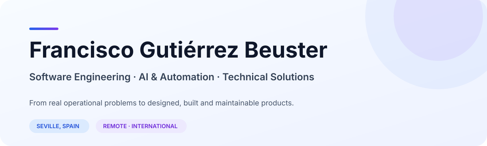
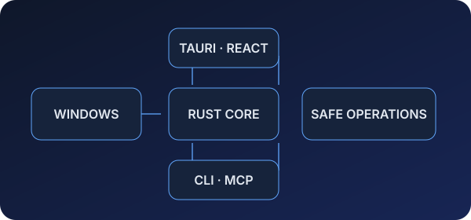
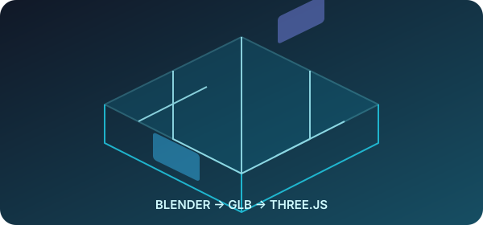
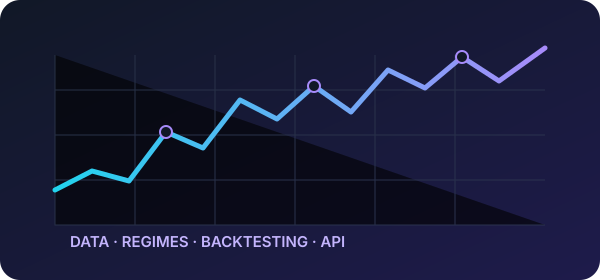

  <picture>
    <source media="(prefers-color-scheme: dark)" srcset="assets/hero/hero-dark.svg">
    <source media="(prefers-color-scheme: light)" srcset="assets/hero/hero-light.svg">
    
  </picture>

  <a href="https://github.com/franki1998">GitHub</a> &nbsp;·&nbsp;
  Seville, Spain &nbsp;·&nbsp;
  Open to remote & international opportunities

 

  I combine a practical background in <strong>Multiplatform Application Development (DAM)</strong>, 
  a <strong>Computer Engineering degree</strong> in progress (expected January 2027), and professional experience 
  building software and automation around real operational problems.

 

<h2 align="center">What I work on</h2>

<table>
  <tr>
    <td width="50%" valign="top">
      <h3>Software Engineering</h3>
      Applications, APIs, system tools and product architecture.
    </td>
    <td width="50%" valign="top">
      <h3>AI & Automation</h3>
      Agents, MCP, LLM workflows and process automation.
    </td>
  </tr>
  <tr>
    <td width="50%" valign="top">
      <h3>Technical Solutions</h3>
      From business requirements to implementable technical systems.
    </td>
    <td width="50%" valign="top">
      <h3>Digital Transformation</h3>
      Turning manual workflows into maintainable software.
    </td>
  </tr>
</table>

One profile, one process: understand the problem, design the solution, build it, and make it usable.

 

<h2 align="center">Selected Projects</h2>

Production-minded projects spanning systems, mobile product, 3D web and data engineering.

<table>
  <tr>
    <td width="50%" valign="top">
      
      <h3><a href="https://github.com/franki1998/Gestor">Gestor ↗</a></h3>
      Local Windows system manager for storage analysis, indexing, duplicate detection and safe maintenance—with CLI and MCP integration for agents.
        
      <code>Rust</code> <code>Tauri</code> <code>React</code> <code>SQLite</code> <code>MCP</code>
    </td>
    <td width="50%" valign="top">
      

        
        
        
        
      

      <h3><a href="https://github.com/franki1998/HuchaApp">Hucha ↗</a></h3>
      Mobile product for planning shared budgets and expenses around committed, used and remaining amounts—designed for a real everyday problem.
        
      <code>React Native</code> <code>Expo</code> <code>TypeScript</code> <code>Node.js</code> <code>PostgreSQL</code>
    </td>
  </tr>
  <tr>
    <td width="50%" valign="top">
      
      <h3><a href="https://github.com/franki1998/3DPiso">3DPiso ↗</a></h3>
      Interactive web viewer that turns Blender scenes into navigable 3D spaces with multiple views, measurements and configurable furniture.
        
      <code>React</code> <code>Three.js</code> <code>TypeScript</code> <code>Blender</code> <code>GLB</code>
    </td>
    <td width="50%" valign="top">
      
      <h3><a href="https://github.com/franki1998/Bot">BTC Market Regime Lab ↗</a></h3>
      Educational quantitative engineering platform for market-data processing, regime analysis and backtesting—not financial advice or a profitability claim.
        
      <code>Python</code> <code>FastAPI</code> <code>React</code> <code>PostgreSQL</code> <code>Docker</code>
    </td>
  </tr>
</table>

 

<h2 align="center">Professional Work</h2>

<table>
  <tr>
    <td valign="top">
      
<strong>PRODUCTION SOFTWARE · MOTORSPORT OPERATIONS</strong>

      <h3>MedulaSport — Timing & Race Management Platform</h3>
      Professional software for participant management, starts and finishes, race sessions, penalties, live results and administration. My work also covers timing integrity, VPS deployment and maintenance, and adapting the system to different competition formats.
        
      <code>FastAPI</code> <code>PostgreSQL</code> <code>JavaScript</code> <code>Linux</code> <code>Apache</code> <code>REST APIs</code>
        
      <strong>Private commercial project · Source code not publicly available.</strong>
    </td>
  </tr>
</table>

 

<h2 align="center">Technical Stack</h2>

<table>
  <tr>
    <td width="33%" valign="top"><strong>Languages</strong>  Java · Python · TypeScript JavaScript · Rust</td>
    <td width="33%" valign="top"><strong>Backend</strong>  Spring Boot · FastAPI Node.js · REST APIs</td>
    <td width="33%" valign="top"><strong>Frontend</strong>  React · React Native Next.js · Three.js</td>
  </tr>
  <tr>
    <td width="33%" valign="top"><strong>Data</strong>  PostgreSQL · MySQL SQLite</td>
    <td width="33%" valign="top"><strong>Infrastructure</strong>  Linux · Apache · Docker Git · Vercel</td>
    <td width="33%" valign="top"><strong>AI & Automation</strong>  LLM integrations · Agents MCP · Process automation</td>
  </tr>
</table>

 

<h2 align="center">Let's build something useful.</h2>

  <a href="https://github.com/franki1998">GitHub</a> &nbsp;·&nbsp;
  Seville, Spain &nbsp;·&nbsp;
  Remote & international

